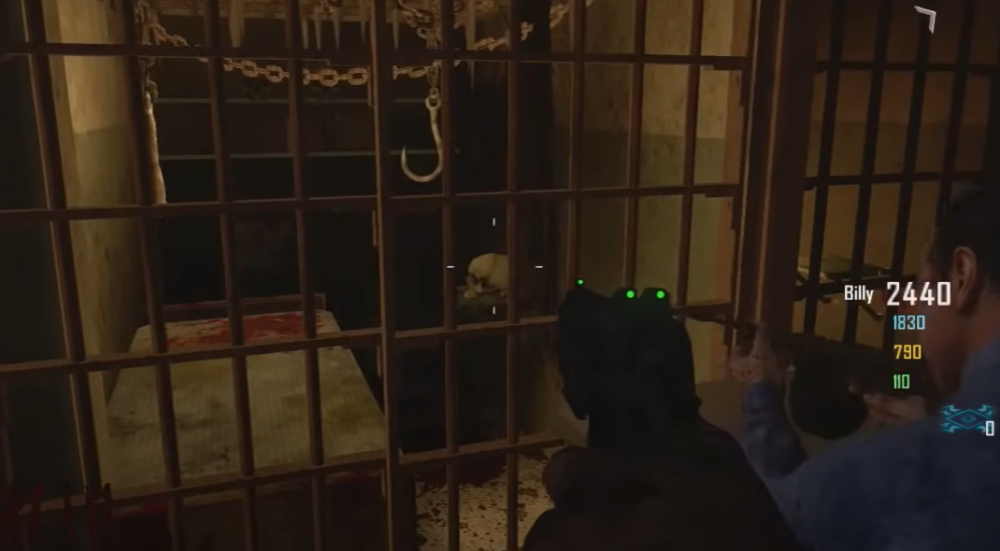
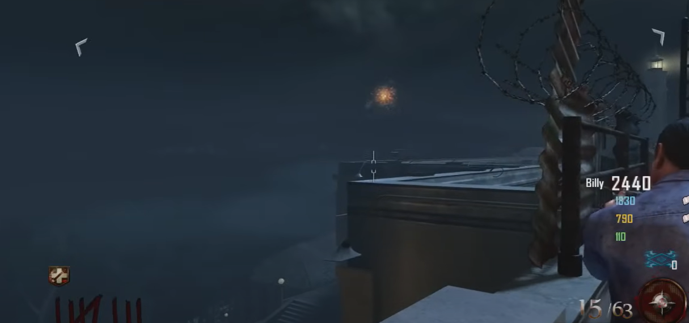
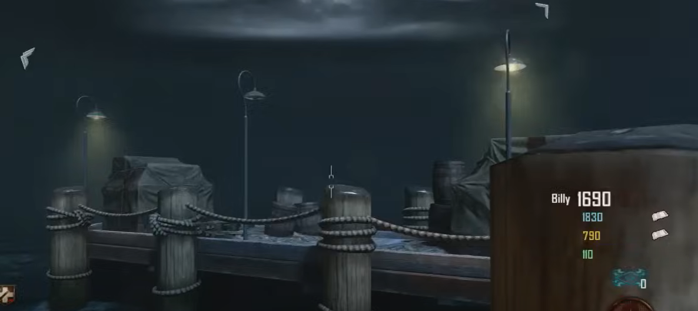
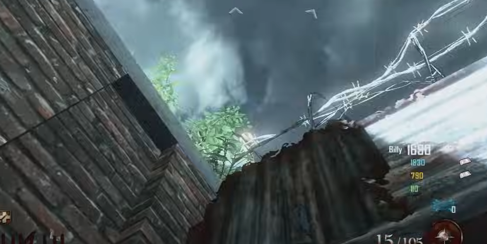
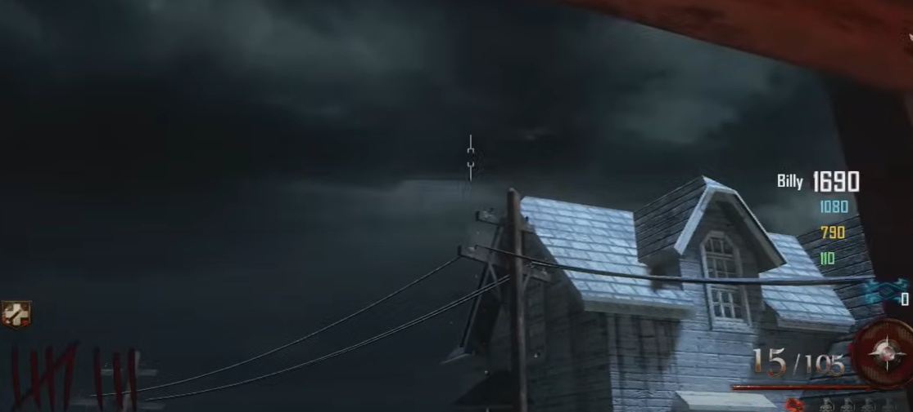

# Free Blundergat Guide
Find five blue skulls in the afterlife and then throw the Hell's Retriever at it to collect it, even though you won't be able to see it normally. Once all five are collected, the Blundergat will spawn out of the desk in the warden's office.

## Skull locations:
Just outside spawn in between the dog head in this jail cell (it is not the actual skull, go into the afterlife to see the correct one):\
\
\
On the corner of the rooftop ledge.\
\
\
On the post of the adjacent dock.\
\
\
In the corner by Juggernog, on the lampost up high.\
\
\
Through the window of the warden's office on the powerline.\

