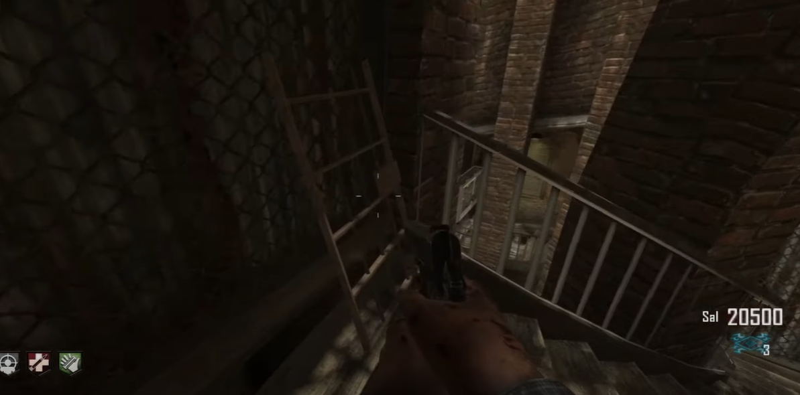
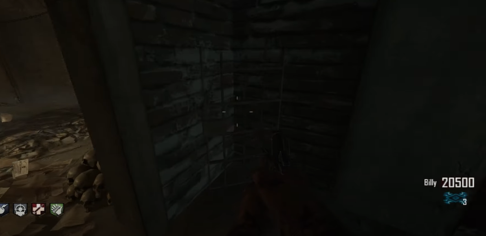
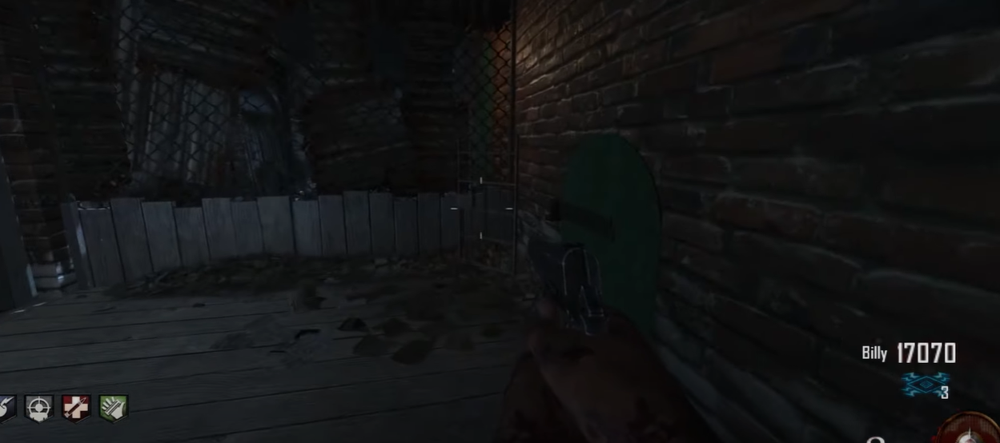
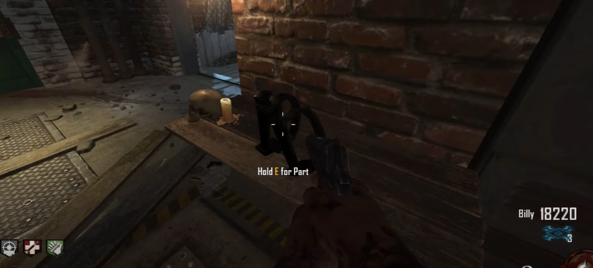
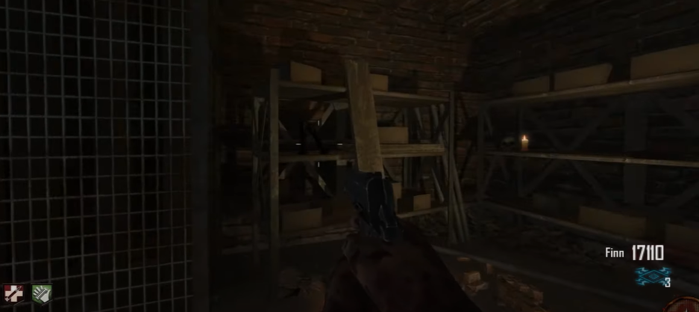
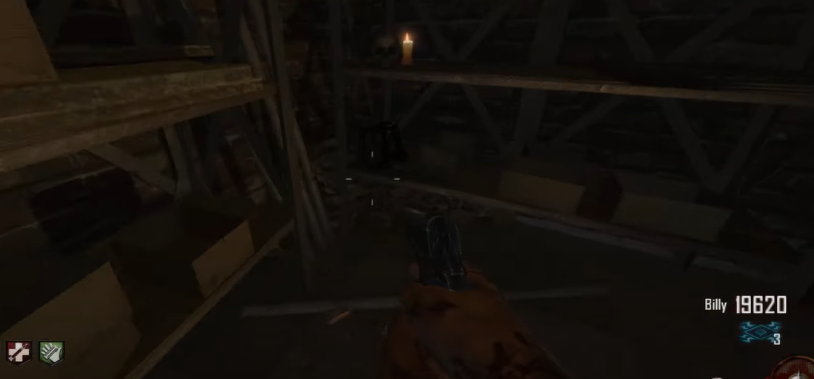
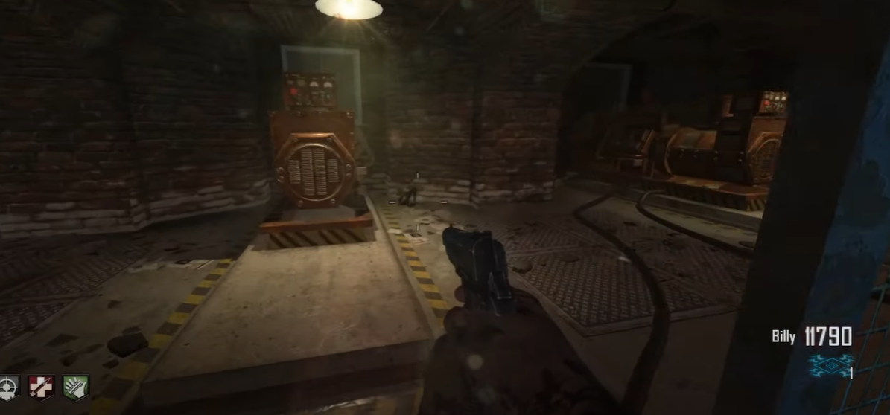
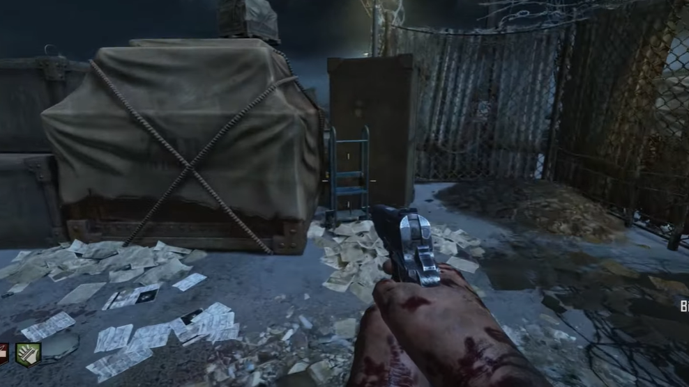
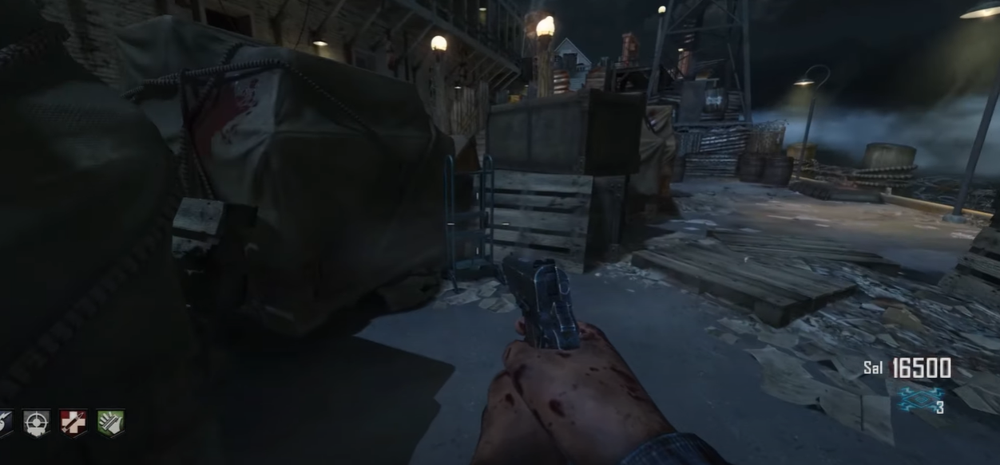
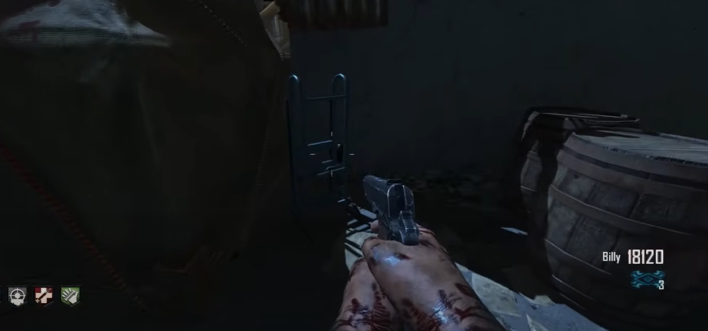

# Mod of the Dead Shield Guide
Can be built at any of the three build tables in the map.

## Cell door locations:
Citadel stairs:\
\
\
Elevator hallway:\
\
\
In the corner outside the electrical building.\

## Handle locations:
On a shelf in the electrical building.\
\
\
On a shelf in the corner of the electrical building.\
\
\
On the other shelf in that same corner.\
\
\
Next to a generator in the electrical building.\

## Dolly locations:
In the corner of this cargo by the docks:\
\
\
In the middle of the cargo by the docks.\
\
\
Right next to the tower trap.\

