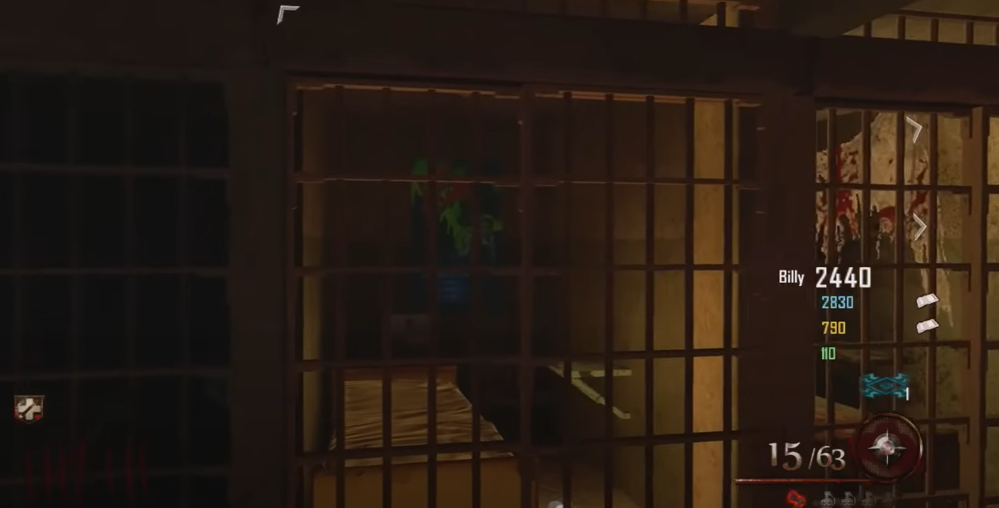
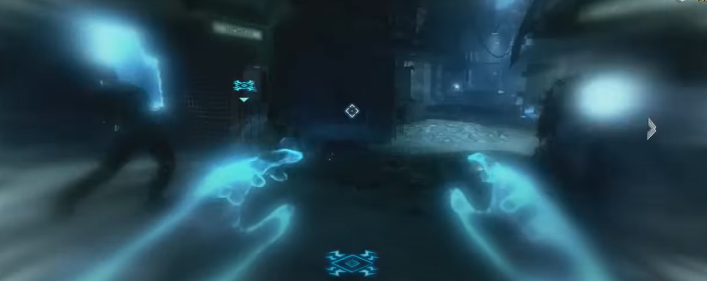
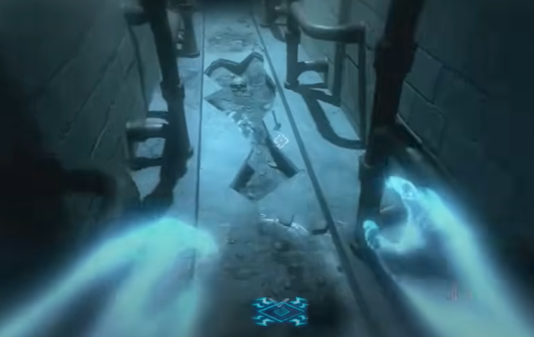
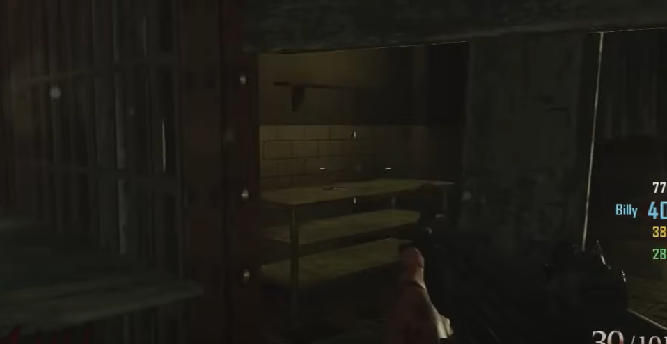

# Spoon Guide

## Note:
* Need the Hell's Retriever
* Need to travel to the Golden Gate Bridge once

## Steps:

### Step 1:
In Michigan Avenue, outside the warden's office, throw the Hell's Retriever at the poster in this jail cell:\
\
\
\
It will reveal a hole in the wall.

### Step 2:
Go into the afterlife and around the corner, there is a new entryway you can access.\
\
\
\
In that area, there will be a spoon on the ground, zap it until it disappears.\
\

### Step 3:
In the back window of the cafeteria throw the Hell's Retriever at this spoon on the table to collect it:\
\

